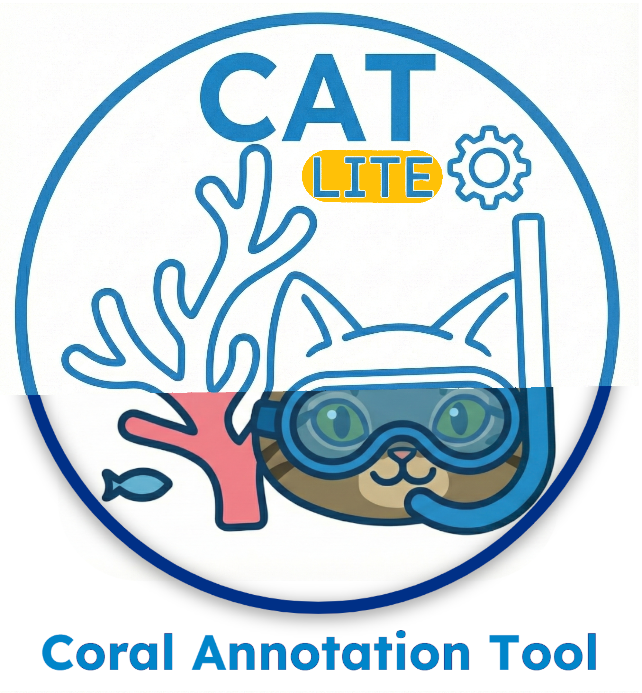

# Coral Annotation Tool (CAT) - Lite Web Version Demo

A simplified, browser-based coral annotation tool for quick demo & fieldwork with  basic annotation tasks. Works entirely in your browser with no installation required!

### Features

- **Interactive Map Interface** - Annotate directly on georeferenced COG imagery
- **Basic Drawing Tools** - Lines, rectangles, and polygons
- **Import/Export** - Save and load projects as JSON

## Quick Start

### Option 1: GitHub Pages 
Simply visit: **https://MichaelAkridge-NOAA.github.io/cat-web-lite/**

## Lite vs Full Version

**CAT Lite** (this version):
- Browser-based, no installation
- Quick field annotations
- Basic drawing and forms
- Import/export projects

**CAT Full** ([Install Here](https://github.com/MichaelAkridge-NOAA/cat)):
- Desktop application with advanced controls
- AI/ML-powered analysis tools
- Batch processing capabilities
- Enhanced export options & integrations
- Offline capabilities
- Advanced annotation features

----------
#### Disclaimer
This repository is a scientific product and is not official communication of the National Oceanic and Atmospheric Administration, or the United States Department of Commerce. All NOAA GitHub project content is provided on an ‘as is’ basis and the user assumes responsibility for its use. Any claims against the Department of Commerce or Department of Commerce bureaus stemming from the use of this GitHub project will be governed by all applicable Federal law. Any reference to specific commercial products, processes, or services by service mark, trademark, manufacturer, or otherwise, does not constitute or imply their endorsement, recommendation or favoring by the Department of Commerce. The Department of Commerce seal and logo, or the seal and logo of a DOC bureau, shall not be used in any manner to imply endorsement of any commercial product or activity by DOC or the United States Government.

#### License
This repository's code is available under the terms specified in [LICENSE.md](./LICENSE.md).
